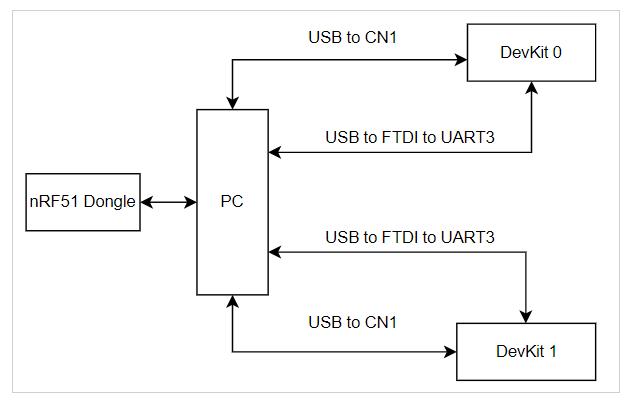

# ble_auto_testing

This project is used to automatically run BLE applications remotely, sniff the BLE packets, save to a file, and parse the file to verify TIFS.  

The related project is [pcapng_parser](https://github.com/yc-adi/pcapng_parser).

## Usage
### Hardware setup 
In this test, two MAX32655 DevKit boards are used. 

Following the instructions in the README of project [VSCode-Maxim](https://github.com/Analog-Devices-MSDK/VSCode-Maxim), program the [BLE5_ctr project](https://github.com/Analog-Devices-MSDK/msdk/tree/main/Examples/MAX32655/BLE5_ctr) into the two DevKit boards. 

Then the setup for this test is illustrated in the following figure.




### Find the devices on a Ubuntu machine
Find the interface name of this sniffer.
```
python -m nrf_sniffer_ble --extcap-interfaces
extcap {version=4.1.0}{display=nRF Sniffer for Bluetooth LE}{help=https://www.nordicsemi.com/Software-and-Tools/Development-Tools/nRF-Sniffer-for-Bluetooth-LE}
interface {value=/dev/ttyACM0-None}{display=nRF Sniffer for Bluetooth LE}
...
```
It shows that the interface is "/dev/ttyACM0-None".

```
# without the board 0 UART3 connected
dmesg -wH
# plug in the board 0 UART3 FTDI USB cable
[Aug26 14:03] usb 1-1.4.4.2: new full-speed USB device number 8 using ehci-pci
[  +0.244200] usb 1-1.4.4.2: New USB device found, idVendor=0403, idProduct=6015, bcdDevice=10.00
[  +0.000011] usb 1-1.4.4.2: New USB device strings: Mfr=1, Product=2, SerialNumber=3
[  +0.000003] usb 1-1.4.4.2: Product: FT230X Basic UART
[  +0.000003] usb 1-1.4.4.2: Manufacturer: FTDI
[  +0.000002] usb 1-1.4.4.2: SerialNumber: DT03O9WB
[  +0.003359] ftdi_sio 1-1.4.4.2:1.0: FTDI USB Serial Device converter detected
[  +0.000041] usb 1-1.4.4.2: Detected FT-X
[  +0.001068] usb 1-1.4.4.2: FTDI USB Serial Device converter now attached to ttyUSB1
```
The device identified is /dev/ttyUSB1.

```
# power up board 1
[Aug26 14:12] usb 1-1.4.4.3: new full-speed USB device number 10 using ehci-pci
[  +0.236454] usb 1-1.4.4.3: New USB device found, idVendor=0403, idProduct=6015, bcdDevice=10.00
[  +0.000019] usb 1-1.4.4.3: New USB device strings: Mfr=1, Product=2, SerialNumber=3
[  +0.000003] usb 1-1.4.4.3: Product: FT230X Basic UART
[  +0.000003] usb 1-1.4.4.3: Manufacturer: FTDI
[  +0.000002] usb 1-1.4.4.3: SerialNumber: D309ZDE9
[  +0.003356] ftdi_sio 1-1.4.4.3:1.0: FTDI USB Serial Device converter detected
[  +0.000052] usb 1-1.4.4.3: Detected FT-X
[  +0.001249] usb 1-1.4.4.3: FTDI USB Serial Device converter now attached to ttyUSB2
```
The board 1 UART0 port is /dev/ttyUSB2.

```
# plug in the board 1 UART3 FTDI USB cable
[Aug26 14:13] usb 1-1.4.4.4: new full-speed USB device number 11 using ehci-pci
[  +0.228051] usb 1-1.4.4.4: New USB device found, idVendor=0403, idProduct=6015, bcdDevice=10.00
[  +0.000010] usb 1-1.4.4.4: New USB device strings: Mfr=1, Product=2, SerialNumber=3
[  +0.000004] usb 1-1.4.4.4: Product: FT230X Basic UART
[  +0.000002] usb 1-1.4.4.4: Manufacturer: FTDI
[  +0.000002] usb 1-1.4.4.4: SerialNumber: DT03OFQ0
[  +0.003422] ftdi_sio 1-1.4.4.4:1.0: FTDI USB Serial Device converter detected
[  +0.000046] usb 1-1.4.4.4: Detected FT-X
[  +0.001223] usb 1-1.4.4.4: FTDI USB Serial Device converter now attached to ttyUSB3
```
The board 1 UART1 port is /dev/ttyUSB3.

### Local test

### Windows
In a Windows terminal, cd the source code folder.
```
.\venv\Scripts\activate
python -m ble-auto-testing -h
```
In the virtual environment, run the test.
```
python -m ble-auto-testing --interface COM4-None --device "" --brd0-addr 00:11:22:33:44:11 --brd1-addr 00:11:22:33:44:12 --sp0 COM9 --sp1 COM10 --time 30 --tshark "C:\Program Files\Wireshark\tshark.exe" 
```

### Linux

```
python -m ble-auto-testing --interface /dev/ttyACM0-None --device "" --brd0-addr 00:11:22:33:44:11 --brd1-addr 00:11:22:33:44:12 --sp0 /dev/ttyUSB1 --sp1 /dev/ttyUSB3 --time 30 --tshark /usr/bin/tshark
```

#### Individually test the Sniffer
```
--capture --extcap-interface /dev/ttyACM0-None --device "" --fifo FIFO --extcap-control-in EXTCAP_CONTROL_IN --extcap-control-out EXTCAP_CONTROL_OUT --auto-test --timeout 10

```
python -m ble-auto-testing --interface /dev/ttyACM0-None --device "" --brd0-addr 00:11:22:33:44:11 --brd1-addr 00:11:22:33:44:12 --sp0 /dev/ttyUSB1 --sp1 /dev/ttyUSB3 --time 30 --tshark /usr/bin/tshark
```

